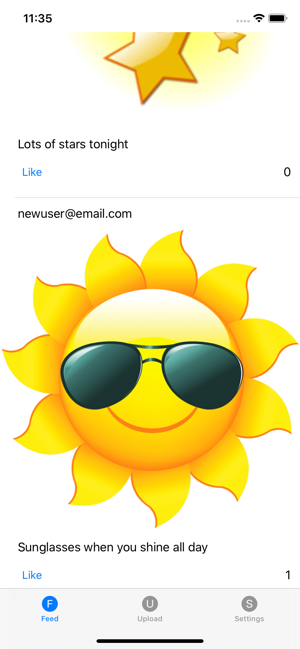
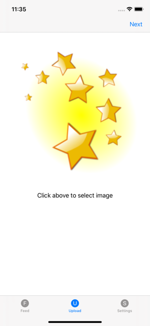
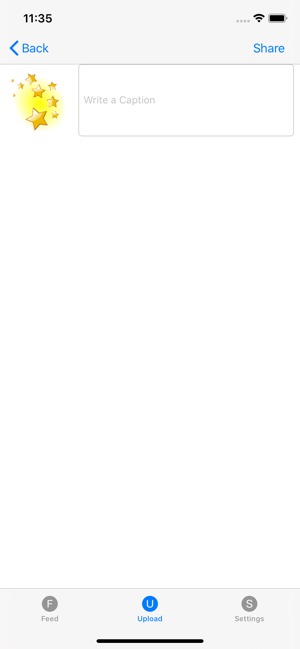

# Instagram Clone

### Description

Recreating the core functionality of Instagram. 

Uses Firestore database in Firebase to read/write data. Login / signup controlled by Firebase authentication. 

Upload photos are selected with an image picker controller. Posts are uniquely identified locally, then image, caption and date are uploaded to Firebase.

Feed is populated with all available posts, sorted by newest. The like button checks to see if a user has already liked the Post, then adds or removes a like to ensure only one vote per post per user.

### Usage

Requires creating a new [Firebase project](https://console.firebase.google.com/).

Download new GoogleService-Info.plist file and add to project.

Under Firebase Authentication, enable email/password.

Under Firebase Database, setup Firestore.

### Images

   

 

